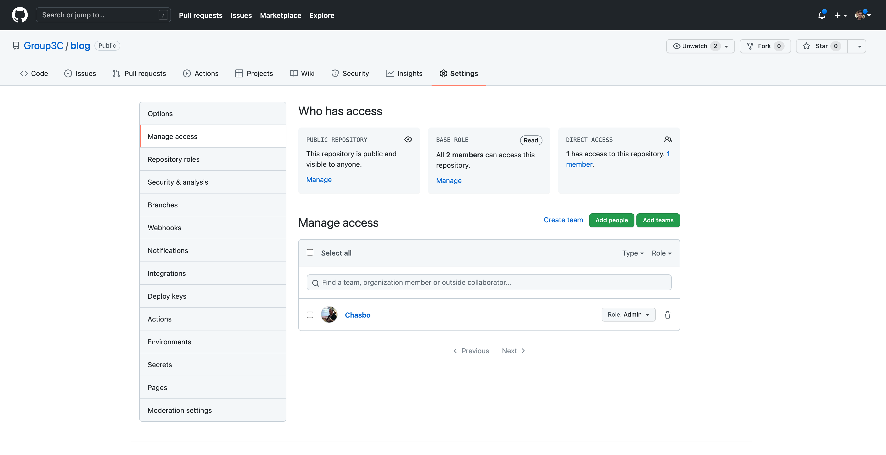

# How to add people
You can invite people from `Settings > Manage access` section: https://github.com/Group3C/blog/settings/access

# How to attach files
You can add images to your post by using relative references to the files eg. ``

# How to manage versions
Github saves the state of the wiki as a `revision`. Creating, deleting and updating pages generate a new `revision`.
Each `revision` in this wiki gets its own git commit and is added to the [history](https://github.com/Group3C/blog/wiki/Home/_history)

You can compare revisions to get a [diff](https://github.com/Group3C/blog/wiki/Home/_compare/c106c3411729605aad18713c543b4af49e08379f...20fc36358b31e7bbdb343af7aa309dc68401c82e)
